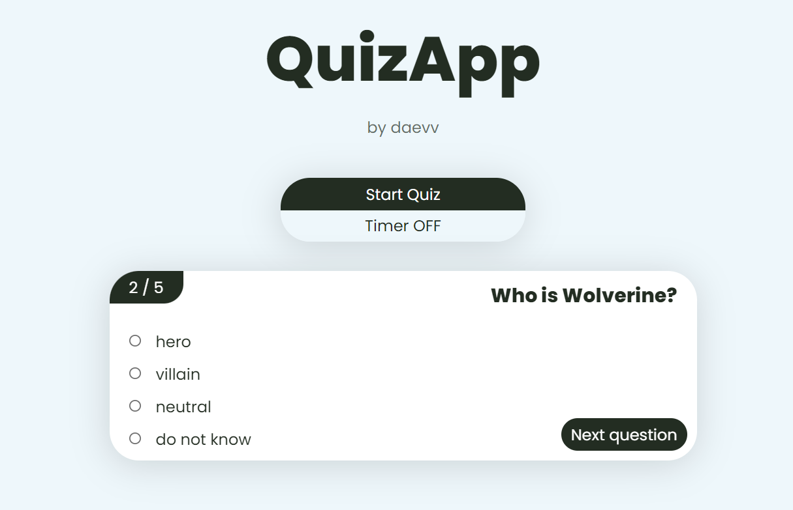

# Quizapp


### Description
<p>Simple pet-prpject in OOP style.</p>
<p>Try to play quiz with 5 simple question and get your result at the end.</p>
<a href="https://daevv.github.io/QuizApp/" target="_blank">Play now!</a>

### Making your own Quiz

<p>If you want to play your own quiz, modify <b>./js/const/questons.js</b> file</p>

```
const questions = [
    // each question is an object with four fields
    // start to count elements in answers array from 1
  {
    question: 'Who is Spider Man?',
    answers: ['hero', 'villain', 'neutral', 'do not know'],
    correctAnswerId: '1',
    questionNumber: 1,
  },
  ...
];
```

### Technologies
- JS
- CSS
- HTML
